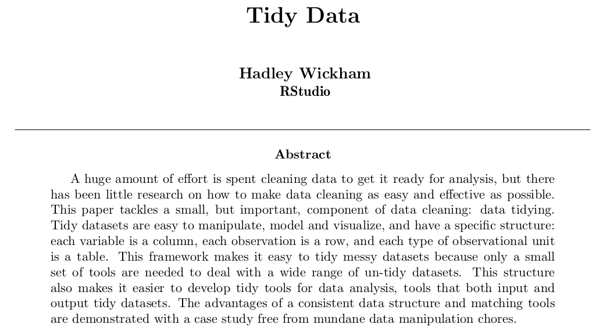
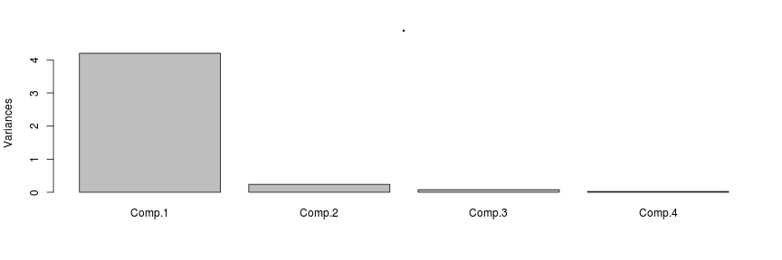

Data wrangling with tidyr and dplyr
========================================================
author: Jorge Langa
date: 20-01-2016

Requirements
========================================================

This small tutorial requires you to have installed an R version equal or posterior to 3.1.2.

To know which R version you are using just start R in a console or in Rstudio.

The required packages are `tidyr` and `dplyr`.


```r
install.packages(
  c('tidyr', 'dplyr')
)
```


What is tidy data?
=============================================

There is a paper on tidy data!



[link](http://www.jstatsoft.org/article/view/v059i10)


What is tidy data?
=============================================

Tidy data is data organised in a way that:

- Each variable is saved in its own column.

- Each observation is saved in its own row.


Is this tidy data?
==============================================


```r
raw_data <- data.frame(
  name = c("Wilbur", "Petunia", "Gregory"),
  a = c(67, 80, 64),
  b = c(56, 90, 50)
)
```

```
     name  a  b
1  Wilbur 67 56
2 Petunia 80 90
3 Gregory 64 50
```


Is this now tidy data?
==============================================


```
     name drug heartrate
1  Wilbur    a        67
2 Petunia    a        80
3 Gregory    a        64
4  Wilbur    b        56
5 Petunia    b        90
6 Gregory    b        50
```

Why do I need to tidy data?
==============================================

- Data comes always messy from the beginning.

- Tidy data is easier to process.

- (Big) data processing with Excel can take too much time, even using macros.


The %>% (pipe) operator
===============================================

- Comes from the package `magrittr` and every modern package uses it.

- Makes code more readable because it can be read as "send the results to" another function:

  - A numeric function: `mean()`, `var()`, `princomp()`, `lm()`
  
  - A plot: `plot()`
  
  - A file: `write.csv()`


%>% examples
================================================


```r
raw_data$a %>% mean
```

```
[1] 70.33333
```


```r
iris[,c(1:4)] %>%
  princomp()
```

```
Call:
princomp(x = .)

Standard deviations:
   Comp.1    Comp.2    Comp.3    Comp.4 
2.0494032 0.4909714 0.2787259 0.1538707 

 4  variables and  150 observations.
```


%>% examples
================================================


```r
iris[,c(1,2,3,4)] %>%
  princomp() %>%
  plot()
```




The %>% operator
================================================

- `%>%` sends your data to the first parameter by default.

- To send it to another one, point it with a `.` (dot):


```r
data %>%
  lm(height ~ weight, data = .)
```

- Using the dot in the first parameter is equivalent to not using it


```r
data %>% mean(., na.rm=T)
data %>% mean(na.rm=T)
```


Why should I use such an ugly symbol?
==========================================================================

It makes your code more readable:

As an example, take this nested chunk of code


```r
arrange(
  summarize(
    filter(data,
           variable == numeric_value),
           Total = sum(variable)
    ),
    desc(Total)
)
```

???


Why should I use such an ugly symbol?
==========================================================================

If we organize it a little bit using variables it has the following shape:


```r
a <- filter(data, variable == numeric_value)
b <- summarise(a, Total = sum(variable))
c <- arrange(b, desc(Total))
```

But with `%>%` we save time and memory:


```r
data %>%
  filter(variable == numeric_value) %>%
  summarise(Total = sum(variable)) %>%
  arrange(desc(Total))
```


tidyr
=======================================

4 functions:

- `gather()` and `spread()`

- `separate()` and `unite()`


tidyr: gather
=======================================

Takes multiple columns, and gathers them into key-value pairs (makes data "longer"):


```r
long_data <- raw_data %>%
  gather(drug, heartrate, a:b)

long_data
```

```
     name drug heartrate
1  Wilbur    a        67
2 Petunia    a        80
3 Gregory    a        64
4  Wilbur    b        56
5 Petunia    b        90
6 Gregory    b        50
```


tidyr: spread
======================================

Oposite as `gather`: convert "long" tables into "wider" ones by adding new columns:


```r
long_data %>%
  spread(drug, heartrate)
```

```
     name  a  b
1 Gregory 64 50
2 Petunia 80 90
3  Wilbur 67 56
```

tidyr: separate
=======================================

Sometimes there are multiple values in the same column:


```r
tidier
```

```
  id       trt     key       time
1  1 treatment work.T1 0.08513597
2  2   control work.T1 0.22543662
3  3 treatment work.T1 0.27453052
4  4   control work.T1 0.27230507
5  1 treatment home.T1 0.61582931
6  2   control home.T1 0.42967153
7  3 treatment home.T1 0.65165567
8  4   control home.T1 0.56773775
```


tidyr: separate
=======================================

`separate` splits those `location.Ttime` into `location` and `time`:


```r
separated <- tidier %>%
  separate(key, into= c("location", "time"), sep="\\.")
separated
```

```
  id       trt location time       time
1  1 treatment     work   T1 0.08513597
2  2   control     work   T1 0.22543662
3  3 treatment     work   T1 0.27453052
4  4   control     work   T1 0.27230507
5  1 treatment     home   T1 0.61582931
6  2   control     home   T1 0.42967153
7  3 treatment     home   T1 0.65165567
8  4   control     home   T1 0.56773775
```


tidyr: unite
=======================================

Combine two columns into one:


```r
separated %>%
  unite(key, location, time, sep= ".")
```

```
  id       trt     key
1  1 treatment work.T1
2  2   control work.T1
3  3 treatment work.T1
4  4   control work.T1
5  1 treatment home.T1
6  2   control home.T1
7  3 treatment home.T1
8  4   control home.T1
```


dplyr: The fun part
=======================================

- Filtering of rows and columns: `select()` and `filter()`.

- Agregation of data: `group_by()`, `summarise()`

- Sort: `arrange()`.

- Merge and intersect: `join()`.

- Create new columns: `mutate()`.


dplyr: select and rename columns and drop the others
========================================


```r
DNase %>% head(2)
```

```
  Run       conc density
1   1 0.04882812   0.017
2   1 0.04882812   0.018
```

```r
DNase %>%
  select(run = Run, density) %>%
  head(3)
```

```
  run density
1   1   0.017
2   1   0.018
3   1   0.121
```


dplyr: filter rows by value
==========================================

```r
DNase %>% head(2)
```

```
  Run       conc density
1   1 0.04882812   0.017
2   1 0.04882812   0.018
```

```r
DNase %>%
  filter(conc > 0.5) %>%
  head(3)
```

```
  Run    conc density
1   1 0.78125   0.377
2   1 0.78125   0.374
3   1 1.56250   0.614
```


dplyr: group_by categorical values
========================================


```r
DNase %>%
  group_by(Run) %>%
  head(3)
```

```
Source: local data frame [3 x 3]
Groups: Run [1]

     Run       conc density
  (fctr)      (dbl)   (dbl)
1      1 0.04882812   0.017
2      1 0.04882812   0.018
3      1 0.19531250   0.121
```


dplyr: summarise a group with a function
================================================


```r
DNase %>%
  group_by(Run) %>%
  summarise(
    mean_density = mean(density),
    mean_conc    = mean(conc)) %>%
  head(5)
```

```
Source: local data frame [5 x 3]

     Run mean_density mean_conc
  (fctr)        (dbl)     (dbl)
1     10    0.7206250  3.106689
2     11    0.7098750  3.106689
3      9    0.7058750  3.106689
4      1    0.6770625  3.106689
5      4    0.6806250  3.106689
```


dplyr: arrange by column
=================================================


```r
DNase %>%
  arrange(conc) %>%
  head(2)
```

```
  Run       conc density
1   1 0.04882812   0.017
2   1 0.04882812   0.018
```

```r
DNase %>%
  arrange(desc(conc)) %>%
  head(3)
```

```
  Run conc density
1   1 12.5   1.730
2   1 12.5   1.710
3   2 12.5   1.932
```


dplyr: join two tables by column names
=================================================

- ìnner_join: Include only rows in both x and y that have a matching value.

- left_join: Include all of x, and matching rows of y.

- semi_join: Include rows of x that match y but only keep the columns from x.


dplyr: join two tables by column names
=================================================

```r
x <- data.frame(
  name= c("John", "Paul", "George", "Ringo", "Stuart", "Pete"),
  instrument= c("guitar", "bass", "guitar", "drums", "bass", "drums")
)

y <- data.frame(
    name= c("John", "Paul", "George", "Ringo", "Brian"),
    band= c(T, T, T, T, F)
)
```


dplyr: join two tables by column names
===============================================


```r
x %>%
  inner_join(y)
```

```
    name instrument band
1   John     guitar TRUE
2   Paul       bass TRUE
3 George     guitar TRUE
4  Ringo      drums TRUE
```


dplyr: mutate can create new variables
================================================


```r
women %>%
  mutate(
    z_height = (height - mean(height)) / sd(height),
    z_weight = (weight - mean(weight)) / sd(weight)) %>%
  head(5)
```

```
  height weight   z_height   z_weight
1     58    115 -1.5652476 -1.4022687
2     59    117 -1.3416408 -1.2732255
3     60    120 -1.1180340 -1.0796608
4     61    123 -0.8944272 -0.8860962
5     62    126 -0.6708204 -0.6925315
```


Exercise: Liver expression in Zebrafish
=================================================

1. Load the `liver_3.gff` first 7 columns into R.

2. Compute how many transcripts are expressed in the 1st chromosome.

3. Compute how many transcripts are expressed in the + strand for each chromosome, in descending order.

4. Compute in which strand is the longest transcript.

5. Plot the mean exon length in the first ten chromosomes.

Wrapping up
=================================================

- Code is more readable with `%>%`

- Data tidying is easy to do.

- Tidy data is easy to analyse.

- Tidy data is less time consuming for you and your laptop.

- No more `for`, `$`, `[[]]` and `[]`.


Resources
=================================================

Hadley Wickham’s dplyr tutorial at useR! 2014, [Part 1]()

Hadley Wickham’s dplyr tutorial at useR! 2014, [Part 2]()

[Introduction to dplyr for Faster Data Manipulation in R](https://rpubs.com/justmarkham/dplyr-tutorial).

Data Wrangling Cheatsheet [pdf](https://www.rstudio.com/wp-content/uploads/2015/02/data-wrangling-cheatsheet.pdf)
